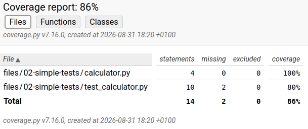
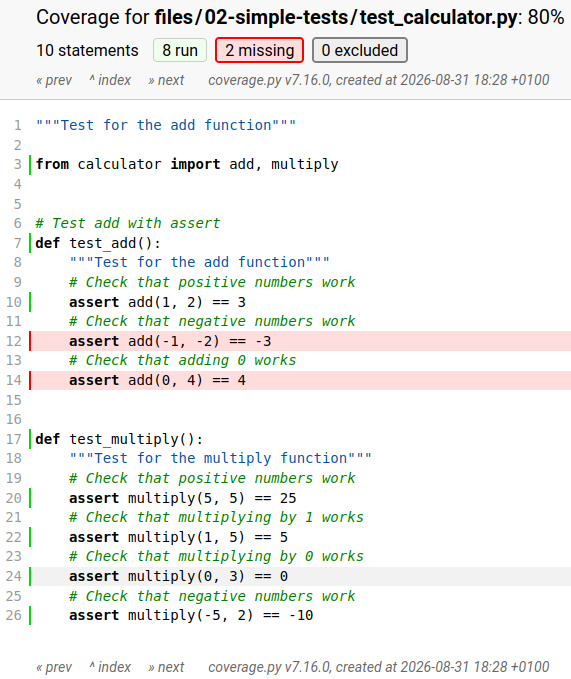

:::::::::::::::::::::::::::::::::::::: questions

- How do I decide what to test?
- How do I know I've tested my project well?
- When can I stop testing?

::::::::::::::::::::::::::::::::::::::::::::::::

::::::::::::::::::::::::::::::::::::: objectives

- Know what code coverage is and how to measure it
- Understand why higher code coverage (usually) means a better tested project
- Understand the limitations of code coverage

::::::::::::::::::::::::::::::::::::::::::::::::

> Testing shows the presence, not the absence of bugs
>
> `r tufte::quote_footer('--- Edsger W. Dijkstra')`

## Test adequacy and code coverage
"How do I know when I've tested my code enough?" is a common question when writing tests.
Unfortunately, this ([provably](https://en.wikipedia.org/wiki/Rice's_theorem)) has no general answer, but we can't write tests forever!
Fortunately, *test adequacy criteria* can help us determine how well we have tested our code and whether we have tested it enough.

*Code coverage* is a very common test adequacy metric that measures the percentage of code in a project that was executed (or "covered") by a particular test (or set of tests).
Intuitively, if parts of your code have not been run by your tests, then you know that those parts of the code are untested and could contain faults.
Code coverage is not a perfect metric --- 100% coverage does not guarantee a fault-free code base --- but it can help you to direct your testing efforts and give you some idea of when you have written enough tests.

We can measure the code coverage at various different levels of granularity, but the most common coverage metric is *line coverage*.
As an example, consider again the `remove_negative_values` function from the previous section:

```python
def remove_negative_values(data: list):
    data_negatives_removed = []
    for i in range(len(data)):
        if data[i] >= 0:
            data_negatives_removed.append(data[i])
    return data

def test_all_negative_values():
    data = [-2, -4, -6, -8, -10]
    assert remove_negative_values(data) == []
```

The `test_all_negative_values` function calls `remove_negative_values` with a list that only contains negative values.
This means that the `data_negatives_removed.append(data[i])` line of the functions is never executed, so `test_all_negative_values` only achieves 80% line coverage of the function body, since only four out of the five lines have been executed.
Note though that this does not make `test_all_negative_values` a bad test, since we would expect other tests in the test suite to cover that line.

## Measuring code coverage
Even for small projects, it is almost impossible to measure code coverage manually.
Fortunately, many tools exist to do this automatically.
In python, we typically use [coverage.py](https://coverage.readthedocs.io/en/7.16.0/) for this.
Let's measure the coverage of the tests for our simple calculator.

From the `my_project` directory where `calculator.py` and `test_calculator.py` are, run the following command in your terminal:
```bash
❯ coverage run -m pytest
```
This will run `pytest` with `coverage` measuring the code coverage of the tests.
As before, if you want to run `pytest` on a specific test file, add this as an argument to the end, e.g.
```bash
❯ coverage run -m pytest test_calculator.py
```

To view the code coverage in your terminal, you can run

```bash
❯ coverage report
```
You should see something similar to the output below
```
Name                                       Stmts   Miss  Cover
--------------------------------------------------------------
files/02-simple-tests/calculator.py            4      0   100%
files/02-simple-tests/test_calculator.py      10      2    80%
--------------------------------------------------------------
TOTAL                                         14      2    86%
```

For each file, we see the name of the file, the total number of statemengs that could be covered (`Stmts`), the number of statements that were covered (`Cover`), and the number that weren't (`Miss`).
Note that the number under `Stmts` may not perfectly match the number of lines in your code file, since blank lines and comments are not counted since they cannot be executed.

For larger projects, examining the code coverage in the terminal can be arduous.
Instead, `coverage` allows us to generate an HTML representation of our code coverage and view this in the browser.
To generate this, run `coverage html` instead of `coverage report`.
```bash
❯ coverage html
```
You will then see something along the lines of `Wrote HTML report to htmlcov/index.html`.
To view this, simply point your browser to the output location, in this case `htmlcov/index.html`.
You will then see a report of the coverage of each of your code files, similar to what was generated from `coverage report`.



To view a file individually, click on its name.
Covered lines are will be marked in green.
Uncovered lines will be highlighted in red.
You can then use this information to design additional tests (or modify your existing tests) to cover the uncovred lines.



## Gaming the system


## Dead code


## Should we aim for 100% test coverage?

Although tests add reliability to your code, it's not always practicable to spend so much development time writing tests.
When time is limited, it's often better to only write tests for the most critical parts of the code as opposed to rigorously testing every function.

You should discuss with your team how much of the code you think should be tested, and what the most critical parts of the code are in order to prioritize your time.

::::::::::::::::::::::::::::::::::::: keypoints

- Complex functions can be broken down into smaller, testable units.
- Testing each unit separately is called unit testing.
- The AAA pattern is a good way to structure your tests.
- Test driven development can help you to write clean, maintainable code.
- Randomness in tests can be made deterministic using random seeds.
- Adding tests to an existing project can be done incrementally, starting with regression tests.

::::::::::::::::::::::::::::::::::::::::::::::::
